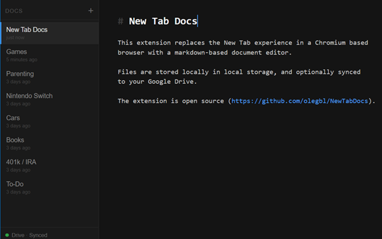

# New Tab Docs

A Chrome extension that replaces the new tab page with a pseudo-WYSIWYG markdown editor. Notes are saved locally and optionally synced to Google Drive.



## Features

- Markdown editor with live syntax highlighting (headings, bold, italic, code, links)
- Multiple tabs, sorted by last edited
- Ctrl+click (or Cmd+click) to open links in a new tab
- Instant local save via `chrome.storage.local`
- Optional Google Drive sync with conflict detection and resolution
- Persisted Drive connection — stays connected across browser restarts

## Install

[**Chrome Web Store →**](https://chrome.google.com/webstore/detail/mopgmbfgiiphfankboijlehiekcpogmm)

Or load unpacked from `dist/` after building locally (see below).

## Development

**Requirements:** Node.js 18+, Yarn

```bash
yarn install
yarn build      # outputs to dist/
yarn test       # run tests
```

Load the extension in Vivaldi/Chrome: go to `chrome://extensions`, enable Developer Mode, click **Load unpacked**, select the `dist/` folder.

## Google Drive sync

Drive sync uses the OAuth 2.0 **authorization-code flow with PKCE** via `chrome.identity.launchWebAuthFlow`, which works in any Chromium-based browser. Click **Connect Drive** in the sidebar footer to authenticate. The flow returns a long-lived **refresh token**, so the connection stays active for weeks — access tokens are refreshed silently in the background with no further prompts.

### Building with your own Google credentials

If you build from source you need your own OAuth client:

1. In [Google Cloud Console](https://console.cloud.google.com/) → **APIs & Services → Credentials**, create an OAuth 2.0 Client ID of type **Web application**, and register the redirect URI `https://<your-extension-id>.chromiumapp.org/`.
2. Put the client ID in `public/manifest.json` (`oauth2.client_id`) and the client secret in `src/drive/config.ts`.
3. On the **OAuth consent screen**, set the publishing status to **In production**. While it stays in *Testing*, Google expires refresh tokens after 7 days, which would re-trigger the sign-in prompt weekly.

> **Note on the client secret:** for a public client like a browser extension the secret is not confidential — it ships inside the extension and is extractable. This is the standard, Google-sanctioned setup for installed/desktop/SPA clients; PKCE is what protects the authorization code. The `drive.file` scope only grants access to files this extension creates.

## Tech stack

- React 18 + TypeScript + Vite
- CodeMirror 6 with GFM markdown extensions
- Google Drive REST API v3
- Vitest + Testing Library

## License

MIT — see [LICENSE](LICENSE)

## Privacy

See [Privacy Policy](https://newtabdocs.lokhvitsky.com/privacy.html)
